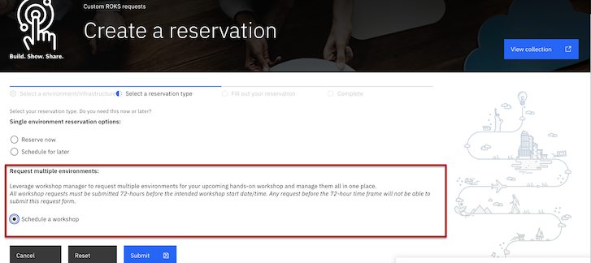
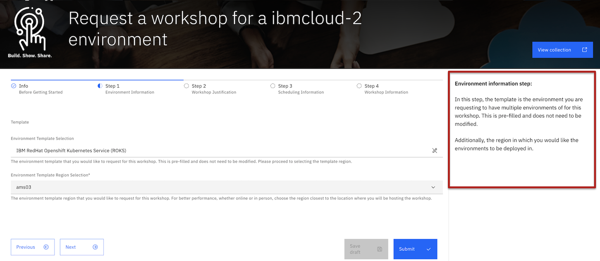

# Enable workshop requests on an IBM Cloud environment 

This runbook will describe how an IBM user or an IBM contributor can request and test an IBM Cloud environment on the workshop manager tool.

**Please note: requesting to enable an IBM Cloud environment on Workshop Manager, you as the requestor (user or content creator) are agreeing to validate and test the workshop flow and functionality before officially promoting the ability to request a workshop on the specified environment.**

Step 1: Understanding what environments can be requested to be enabled for workshops and  what environments are not yet supported on the workshop manager tool.

Example of an IBM Cloud environment that can be requested to be enabled for workshop requests. Look for "IBM Cloud 2" just under the environment title to see what infrastructure this environment is provisioned on. "Hosted" environments infrastructure types can be requested to enable workshops at this time as well. 

Examples of environment types that are not currently supported for workshops include: Systems, Systems 2, Managed OpenShift (ROKS), AWS, and Azure.

Step 2: After validating the environment can be enabled, contact IBM Technology Zone support team via Slack [#itz-workshop-support](https://ibm-dte.slack.com/app_redirect?channel=itz-workshop-support) channel. Please provide the following information in the request:

- Date(s)which you can dedicate to help validate and test the environment through the workshop manager request process and tool. 

- Collection URL that is hosting the specific environment that you would like to enable. See this Custom ROKS Requests collection URL as an example: [https://techzone.ibm.com/collection/custom-roks-vmware-requests](https://techzone.ibm.com/collection/custom-roks-vmware-requests).

- Environment name that is on the tile located on the collection URL. Example screenshot below. **Title: IBM RedHat Openshift Kubernetes Service (ROKS)**

This information will help the support team identify which environment to enable and coordinate with you to help test the environment. 

Step 3: Once a date is established for testing, the support team will enable workshop requests for the environment the morning of the specified testing date. Contact IBM Technology Zone support team if you do not see the workshop request option when selecting to reserve the environment. The workshop request process will look like the following screenshot. If you need help understanding how to get to the reservation form, reference the [How to schedule a workshop](https://github.com/IBM/itz-support-public/blob/main/IBM-Technology-Zone/IBM-Technology-Zone-Runbooks/How-to-schedule-a-skytap-workshop.md) documentation for support. 

Step 4: Select **Schedule a workshop** option and click **submit**. 

Step 5: Fill in additional information on workshop request form. Reference the right side pane through out each step of the request workshop form for additional support and guidance on how to effectively fill in the information being requested. If you have issues submitting the workshop request form, please notify the IBM
 Technology Zone support team. 

Step 6: Provide the IBM Technology Zone support team the name of your workshop. Reference the [How to for instructors](https://github.com/IBM/itz-support-public/blob/main/IBM-Technology-Zone/IBM-Technology-Zone-Runbooks/How%20to%20for%20Instructors.md) to understand the approval workflow after submitting your workshop request.

NOTE: Workshop requests must be requested 72-hours before workshop start date. Due to this environment being tested, the IBM Technology Zone support team will adjust the start date to today's date (testing date agreed upon by user and support team) so that the environments can start provisioning once approved by the support team. 

Step 7: TESTING PHASE 

Please note that these tasks must be checked before officially enabling workshop request option for the specified environment. 

- Successfully able to submit the workshop request form. Reference the [how to schedule a workshop](https://github.com/IBM/itz-support-public/blob/main/IBM-Technology-Zone/IBM-Technology-Zone-Runbooks/How-to-schedule-a-skytap-workshop.md) documentation for additional support.

- Successfully received the following workshop request notifications: Pending approval email, Approved email, Scheduled email, Ready email, Completed email. These emails are generated through the workshop manager tool to inform you every step of the way in the workshop request process. Reference the [how to for instructors](https://github.com/IBM/itz-support-public/blob/main/IBM-Technology-Zone/IBM-Technology-Zone-Runbooks/How%20to%20for%20Instructors.md) documentation to see examples of emails that you should receive through out the workshop request process. 

- Successfully received (and other instructors if any added to the workshop request form) an IBM Cloud email invite. For every IBM Cloud environment on Technology Zone, in order to get access to the environments, you will need to formally accept the invite to our own IBM Cloud account in which we are provisioning these environments from. Reference the [how to accept IBM Cloud invite](https://github.com/IBM/itz-support-public/blob/main/IBM-Technology-Zone/IBM-Technology-Zone-Runbooks/ibm-cloud-accept-invite.md) documentation for support on this step.

- Successfully able to access the workshop instructor page. 
  - Navigate to My Workshops page under My Library. 
  - Select your workshop request title in the list of your workshop requests. 
  - See screenshot for example. 

- Ensure environments successfully deployed from the workshop instructor page. 
  - From the instructor page, locate the "environments" section towards the bottom of the page. 
  - To confirm environments have successfully deployed the "Run State" column will read "Ready" for all environments that have successfully deployed. 
  - If any environments have failed to deploy the "Run State" column will read "Failed" for the environment. 

- Test the workshop redeploy environment feature successfully redeploys an environment directly from the instructor page. The environment can be a failed or in a ready Run State to test this feature. Reference the [how to redeploy a workshop environment](https://github.com/IBM/itz-support-public/blob/main/IBM-Technology-Zone/IBM-Technology-Zone-Runbooks/RedeployWorkshopEnv.md) documentation for step by step support on how to use this feature.

- Ensure you can add attendee emails to each environment by selecting **edit environments** button. Add emails of attendee's to each environment you would like to assign them too. Then make sure to click the **Save changes** button. Additionally, feel free to test leveraging the new [upload attendees](https://github.com/IBM/itz-support-public/blob/main/IBM-Technology-Zone/IBM-Technology-Zone-Runbooks/UploadAttendees.md) feature from the instructor page. Please note that providing the attendee URL to your students is a manual action as of today that you will need to share if you would like attendees to access their environment credentials in this way. Follow the next test to ensure you, as an attendee, can access the attendee page and the environment. 

- Successfully open the attendee URL and login with the workshop password to test claiming an environment as an attendee of the workshop. Reference the [how to for the attendee of the workshop](https://github.com/IBM/itz-support-public/blob/main/IBM-Technology-Zone/IBM-Technology-Zone-Runbooks/How-to-for-Attendee.md) documentation for support on this step. 

- Successfully able to login and access the environment with the access URL and password information provided to you from the instructor view. 
    - From the instructor page, locate the "environments" section towards the bottom of the page. 
    - Find the environment access URL and credentials from the environment drop down menu from the environment line item. 

Step 8: After validating the above test cases, please notify the IBM Technology Zone of any issues you have along the way. The IBM Technology Zone team will work to address any found bugs as soon as possible and keep you updated along the way in case another day of testing is needed. The workshop request date can be extended if additional testing and validation is needed.

Step 9: Once all tests have successfully passed, the environment will be enabled for all IBMers to request a workshop. If you have additional feedback or ideas on how we can improve the workshop manager process or tool, please submit an enhancement request through our [IBM Technology Zone Aha enhancements portal](https://ibm.biz/techzone-enhancements) so our team can properly review and prioritize. 

### Support

IBMers - use the [#itz-workshop-support](https://ibm-techzone.slack.com/archives/CTA2MV9AM) slack channel

For any questions, contact ITZ support - techzone.help@ibm.com
