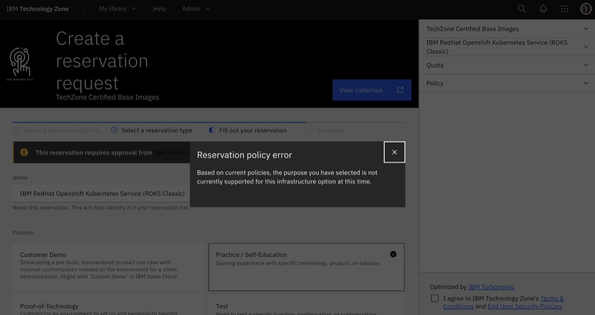
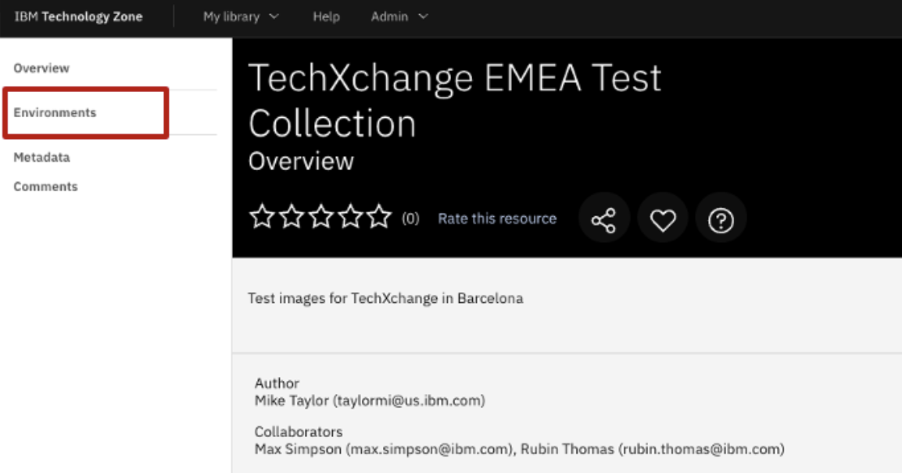
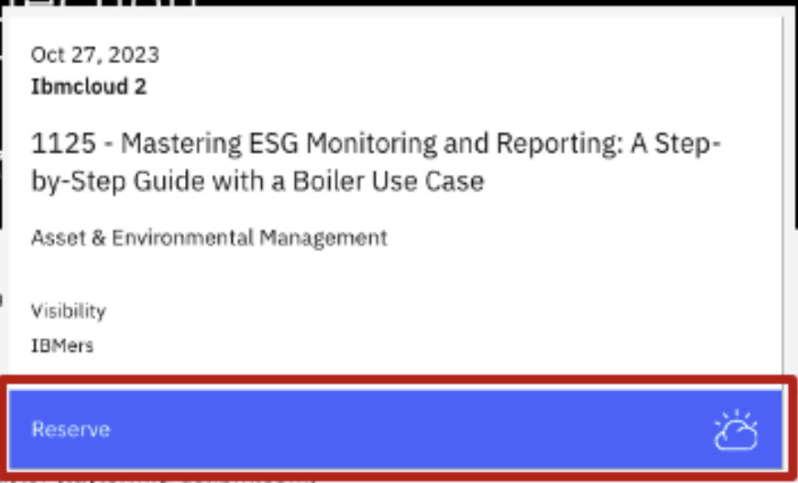
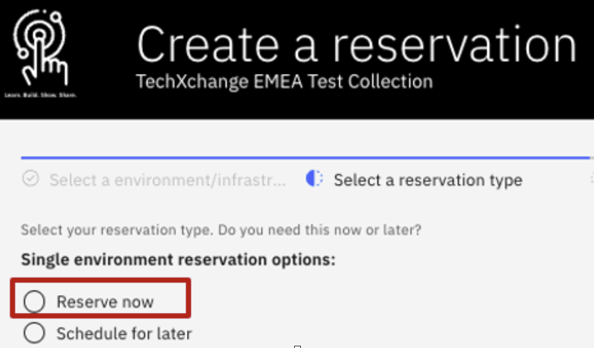
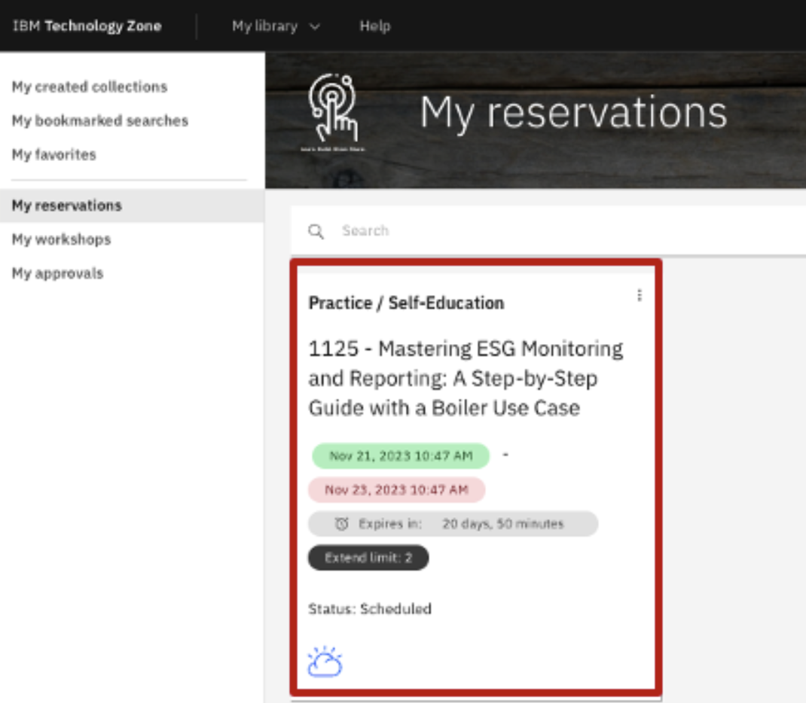

# Environment Testing and Updating Process for Upcoming TechXchange Event

Collection to be used for Barcelona TechXchange lab session environments: https://techzone.ibm.com/collection/64c05508bbbfca00186fc68a

This runbook is to support Lab developers that need to test their environments to be used for TechXchange lab sessions for Barcelona event in January 2024. 

## Table of Contents: 
- [Access](https://github.com/IBM/itz-support-public/blob/main/IBM-Technology-Zone/IBM-Technology-Zone-Runbooks/environment-update-test-techxchange.md#access)
- [Test Provisioning Process](https://github.com/IBM/itz-support-public/blob/main/IBM-Technology-Zone/IBM-Technology-Zone-Runbooks/environment-update-test-techxchange.md#test-provisioning-process)
- [Test and Validate Environment](https://github.com/IBM/itz-support-public/blob/main/IBM-Technology-Zone/IBM-Technology-Zone-Runbooks/environment-update-test-techxchange.md#test-and-validate-environment)
- [Update Environment Process](https://github.com/IBM/itz-support-public/blob/main/IBM-Technology-Zone/IBM-Technology-Zone-Runbooks/environment-update-test-techxchange.md#update-environment-process)

## Access: 
This collection will be accessible for all TechZone users but an allow list will be created for lab developers to be able to test provisioning and the image itself to confirm that the environment that is being deployed is what is needed to successfully complete the lab guide.

Those that are NOT on the allow list will receive a policy error message that will prevent them from proceeding from reserving the environment. 

If you are a lab developer and you are not on the allow list, please post request via `#barcelona-texc24-labs` Slack channel and provide your TechxChange Barcelona lab session ID that you are the lab developer for. Once we review and confirm you are the lab developer, we will add you to the allow list that will allow you to proceed with reserving the environment for testing. 

## Test Provisioning Process:
This section is for lab developers that need to test the deployment and usability of their environment to be used for a lab session in TechXchange event. 

### Testing Virtualized environments:
1. Navigate to the Barcelona TechXchange collection.

2. Click Environments journey.

3. Find the lab session environment by the `<session id>` or by the `<title>` of the lab session>.
 All environments will be in one of the following formats on this collection. 
    - `<session id>` - `<title of the lab session>`

4. Click the blue reserve button on the environment tile that you are testing.

5. Select ‘Reserve now’ option on the first step of the reservation form.

6. To start filling out the reservation form, you can optionally update the name of the reservation. Otherwise leave the name as is.

7. Select purpose ‘Practice / Self-Education”

8. Leave the Sales Opportunity number field blank. This field is optional with this purpose.

9. Provide a purpose description. Example - “Testing lab `<input session id>`”

10. Select a preferred geography. Virtualized environments will only have one option to choose from. Non-Virtualized environments could offer one or more options. Choose the option in or closest to EMEA. 

11. Select an end date and time. Ensure to select the full length of time needed to complete testing of this environment. This will be the date and time the environment is scheduled to be decommissioned. 

12. The next fields that display will be different depending on if the environment is virtualized or not. 
    - Virtualized environments can optionally provide a student number. 
        - Leverage this field as a test run count. For example, first reservation test input 001. For the second reservation test, if you need it, input 002.
    - Non-virtualized environments, like watsonx.data SaaS, watsonx.ai SaaS, or a customer care gen ai environments: 
        - Ensure to select Dedicated services if prompted. 
        - Choose to enable Db2 or Watson Discovery if prompted and needed.


If there are other options for environments that are not for watsonx (what settings to select on the reservation form), please post questions to your lab Github issue. ([https://github.ibm.com/ITZ/TechX-24-Barcelona/issues](https://github.ibm.com/ITZ/TechX-24-Barcelona/issues))

13. Terms and Conditions: Agree to terms and conditions in the bottom right-hand corner of the reservation form to submit your reservation. 

14. Click Submit.

15. A reservation confirmation page will display upon submitting your reservation form. The provisioning process has now begun, and you will receive an email once the environment is ready.

- Once you receive an email that the environment is ready, the provisioning testing step is complete. Please proceed to the next step to further test and validate the environment itself. 

If you receive a failure to provision email instead of the successful ready email, please provide the error message within in the email and the reservation ID in the correct session ID GitHub issue ([https://github.ibm.com/ITZ/TechX-24-Barcelona/issues](https://github.ibm.com/ITZ/TechX-24-Barcelona/issues))  "Leave a Comment" section and tag `@ITZ/manilla-team` for support. You can find your labs issue by searching for your session ID or session name. 

## Test and Validate Environment Process:

1. Navigate to your My reservations page: [https://techzone.ibm.com/my/reservations](https://techzone.ibm.com/my/reservations) 

2. Click the reservation tile that you would like to test. This will navigate you to the reservation details page. 

3. _If the environment is not in a Ready status, this page will not have the access links available yet for you to further test this step. We will email you once the environment is ready. The status can be found on the reservation tile._

4. Ensure you can access / login to the environment. 

5. Ensure you can complete the lab guide steps using the environment. 

## Update Environment Process:

If you have determined that your template requires updates/fixes, make sure to update an environment that is at start-of-lab; if you have completed any labs in your initial test environment, delete that environment and reserve a new environment. Make any needed changes to the new environment.

After making the needed updates to the reserved environment, proceed with updating the correct session ID GitHub issue ([https://github.ibm.com/ITZ/TechX-24-Barcelona/issues](https://github.ibm.com/ITZ/TechX-24-Barcelona/issues)) by leaving a comment and tagging the `@itz/manilla-team` for support. Ensure to provide the reservation ID in the comment with the request. You can find your labs issue by searching for your session ID or session name.

_**IMPORTANT:** Ensure to request a template before the reservation expires. Once the reservation has expired, the environment will be decommissioned and all updates on the environment will be lost. It is a best practice to request for a template to be created minimally three days before your environment is about to expire to ensure enough time for a template on the environment to be made._

Once the environment has been successfully templated, the TechZone Manilla support team will contact you informing in the Session ID git issue informing you that the template update was successful. Once you receive this message, proceed with deleting the current reservation and navigate back to the same collection where the original was reserved and proceed with testing the new template per the same steps above.


_**NOTE:** The environment tile that you will reserve again will have the same name as before but the underlying template that you updated will now be referenced._
